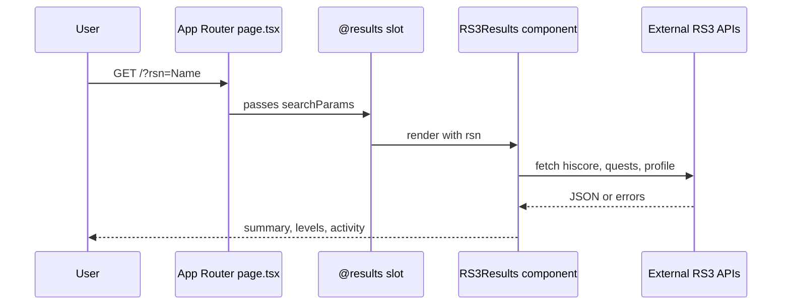
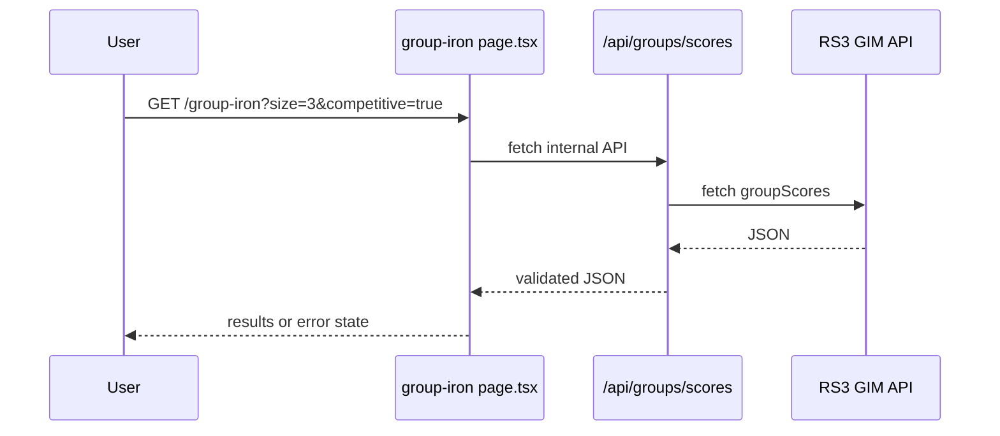

# Agent Onboarding Guide

This repo is optimized for agent-driven, end-to-end feature delivery. Use this file as
source of truth for workflows, architecture, and pitfalls.

## TL;DR Quick Start
1. Clone and enter the repo.
2. Install deps: `bun install`.
3. Run dev server: `bun run dev` and open `http://localhost:3000`.
4. Run checks: `bun run lint`, `bun run test`, `bun run build`.
5. Branch naming: use `codex/<short-topic>` (example: `codex/add-foo`).
6. Read the sections below before touching data fetch or routing.

## Environment & Tooling
- Node: `24.x` (see `package.json`).
- Package manager/runtime: Bun (preferred). npm is acceptable for CI or Netlify.
- Lint: `bun run lint` (ESLint + Next/TS rules).
- Format: `bun run format` (Prettier + Tailwind plugin).
- Type check: `bun run check` (tsc noEmit).
- Tests: `bun run test` (Vitest + jsdom).
- Coverage: `bun run test:coverage` (thresholds in `vitest.config.ts`).

Key configs:
- `/Users/simensfo/devel/vibe-coding/tsconfig.json`: `@/*` alias -> `src/*`.
- `/Users/simensfo/devel/vibe-coding/vitest.config.ts`: jsdom, coverage thresholds.
- `/Users/simensfo/devel/vibe-coding/tests/setup.ts`: Next.js mocks.
- `/Users/simensfo/devel/vibe-coding/next.config.ts`: remote image domains.

Environment variables:
- `NEXT_PUBLIC_BASE_URL` (optional): overrides inferred base URL for internal API
  requests in `/Users/simensfo/devel/vibe-coding/src/app/group-iron/page.tsx`.
- Secrets: place in `.env.local` (never committed).

## Architecture & Data Flow
This is a Next.js App Router project.

Core routes:
- `/Users/simensfo/devel/vibe-coding/src/app/page.tsx`: RS3 progress search.
- `/Users/simensfo/devel/vibe-coding/src/app/@results/page.tsx`: parallel route slot.
- `/Users/simensfo/devel/vibe-coding/src/app/group-iron/page.tsx`: group highscores.
- `/Users/simensfo/devel/vibe-coding/src/app/api/**`: proxy API routes.

Key components:
- `/Users/simensfo/devel/vibe-coding/src/app/components/RS3Progress.tsx`: search
  form, recent searches, and `@results` slot.
- `/Users/simensfo/devel/vibe-coding/src/app/components/RS3Results.tsx`: fetches
  hiscores, quests, profile and renders sections.
- `/Users/simensfo/devel/vibe-coding/src/app/components/RecentSearchesClient.tsx`:
  client-only cookie persistence.

Key libs:
- `/Users/simensfo/devel/vibe-coding/src/lib/api.ts`: external API fetchers.
- `/Users/simensfo/devel/vibe-coding/src/lib/groupIron.ts`: types/guards.
- `/Users/simensfo/devel/vibe-coding/src/lib/format.ts`: display formatting.
- `/Users/simensfo/devel/vibe-coding/src/lib/icons.ts`: skill icon map.

Mermaid flow (RS3 profile page):

Mermaid flow (Group Iron):

## Feature Delivery Workflow
1. Confirm the user story and success criteria.
2. Create a branch: `codex/<short-topic>`.
3. Identify touch points using `rg` and file map above.
4. Prefer Server Components; only add `"use client"` when required.
5. If adding data fetch:
   - Keep fetch logic in `/Users/simensfo/devel/vibe-coding/src/lib/api.ts` or
     a new `src/lib/*` module.
   - Add type guards for external responses when possible.
   - Use `next: { revalidate: <seconds> }` for caching.
6. Update or add tests co-located with source (`*.test.tsx`).
7. Run `bun run lint` and `bun run test` locally.
8. Update AGENTS.md if workflow or architecture changes.
9. Prepare a concise PR description, note any manual testing.

Agent collaboration checklist:
- Declare what you changed, why, and where.
- Flag any new env vars or external dependencies.
- Leave a short test report (commands run and outcome).

## Testing & Quality Gates
- Unit and component tests are in place alongside sources.
- The test harness mocks Next APIs in `/Users/simensfo/devel/vibe-coding/tests/setup.ts`.
- Coverage thresholds are enforced in `/Users/simensfo/devel/vibe-coding/vitest.config.ts`.
- Use `bun run test:coverage` when changing core data paths or utilities.

Mocking pattern example:
- Use `vi.mock('@/lib/api', ...)` in component tests.
- Render server components with `renderToStaticMarkup` when needed.

## External API Guidance (RS3)
Endpoints used:
- Hiscores: `https://secure.runescape.com/m=hiscore/index_lite.json?player=...`
- Quests: `https://apps.runescape.com/runemetrics/quests?user=...`
- Profile: `https://apps.runescape.com/runemetrics/profile/profile?user=...`
- Group Ironman: `https://secure.runescape.com/m=runescape_gim_hiscores//v1/groupScores`

Expected behaviors:
- APIs can return non-200 responses or unexpected shapes.
- RuneMetrics data may be private; treat failures as nullable data.
- Group Iron API can return HTML or non-JSON; proxy validates.

Safe patterns:
- Always tolerate `null` from fetchers in `/Users/simensfo/devel/vibe-coding/src/lib/api.ts`.
- Use type guards for upstream JSON (see `/Users/simensfo/devel/vibe-coding/src/lib/groupIron.ts`).
- Prefer mocking external fetch in tests to avoid flakiness.

Extending APIs:
- Add new API route under `/Users/simensfo/devel/vibe-coding/src/app/api`.
- Validate inputs and response shape before returning JSON.
- Add tests next to the route (`route.test.ts`).

## Deployment & Ops Notes
Netlify:
- Build command: `npm run build` (see `/Users/simensfo/devel/vibe-coding/netlify.toml`).
- Publish directory: `.next`.
- Next.js plugin: `@netlify/plugin-nextjs`.

Post-deploy smoke test:
1. Load `/` and submit a known RSN.
2. Verify summary, levels, and activity render.
3. Load `/group-iron` with query and verify results render.
4. Check recent searches cookie updates after a query.

## Troubleshooting & FAQs
- Results not showing in `/`:
  - Confirm `@results` slot exists at `/Users/simensfo/devel/vibe-coding/src/app/@results/page.tsx`.
  - Ensure `rsn` query param is present and trimmed.
- Recent searches not persisting:
  - Confirm `RecentSearchesClient` renders and `document.cookie` is set.
- External fetch returns null:
  - Treat as normal; show warning banner and avoid hard failures.
- Group Iron API errors:
  - Validate `size` (2-5), `competitive` (true/false) and `page` values.

## Where To Look
| Task | File |
| --- | --- |
| RS3 main page | `/Users/simensfo/devel/vibe-coding/src/app/page.tsx` |
| Results slot | `/Users/simensfo/devel/vibe-coding/src/app/@results/page.tsx` |
| RS3 search form | `/Users/simensfo/devel/vibe-coding/src/app/components/RS3Progress.tsx` |
| Fetchers | `/Users/simensfo/devel/vibe-coding/src/lib/api.ts` |
| Group Iron page | `/Users/simensfo/devel/vibe-coding/src/app/group-iron/page.tsx` |
| Group Iron API | `/Users/simensfo/devel/vibe-coding/src/app/api/groups/scores/route.ts` |
| Test setup | `/Users/simensfo/devel/vibe-coding/tests/setup.ts` |
| Vitest config | `/Users/simensfo/devel/vibe-coding/vitest.config.ts` |
| Netlify config | `/Users/simensfo/devel/vibe-coding/netlify.toml` |
